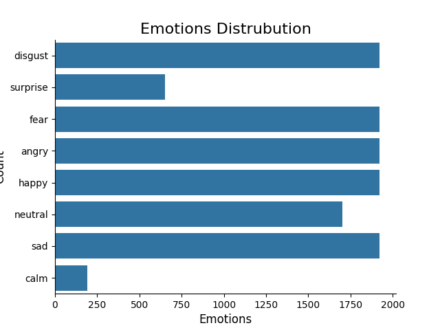

# Speech Emotion Recognition Overview

## What

Speech Emotion Recognition (SER) is a transformative technology in human-computer interaction (HCI) that enables systems to interpret and respond to users' emotions. 
By analyzing vocal cues, SER facilitates more empathetic and context-aware interactions. Key applications include:

* Enhanced Communication: SER improves virtual assistants and smart speakers by deciphering ambiguous expressions, such as varied uses of "really," for more nuanced responses. 
* Safety and Assistance: In high-stress environments like vehicle systems or aircraft cockpits, SER can detect emotional states like stress or fatigue, enhancing safety. 
* Therapeutic and Educational Tools: SER is pivotal in e-learning systems, therapy applications, and stress management, providing tailored emotional support. 
* E-commerce and Entertainment: Call centers benefit from SER by understanding customer sentiment, while interactive storytelling in entertainment becomes more engaging through emotional context.

## Why

SER is essential for advancing intelligent systems for several reasons:

* Improved Interaction Quality: By understanding emotions, SER enhances human-computer interactions, making them more intuitive and empathetic. 
* Broader Application Scope: From therapy to entertainment, SER broadens the capabilities of AI across diverse fields. 
* Addressing Data Scarcity: Augmentation and new datasets allow SER models to overcome limitations of small, imbalanced datasets, fostering better performance.

## How

#### Dataset Categorization
SER relies on various datasets to train models effectively. These datasets are classified into three categories based on the nature of the speech data:

* Simulated Datasets: Created by actors delivering the same sentences with varying emotional tones. Examples:
  * EMO-DB (German)
  * RAVDESS 
  * CREMA-D 
  * TESS
These datasets offer consistency and are ideal for benchmarking but may overfit exaggerated emotions not common in real-world contexts.

* Semi-Natural Datasets: Produced by individuals or actors enacting scenarios involving specific emotions. Examples:
  * IEMOCAP 
  * Belfast
These datasets provide speech closer to real-life utterances but can lack authenticity since emotions are scenario-driven and constrained by predefined scripts.
  
* Natural Datasets: Collected from real-life interactions, such as spontaneous expressions in television broadcasts or YouTube videos. Examples:
  * VAM 
  * AIBO
These datasets authentically capture emotional nuances but pose challenges like background noise, privacy concerns, and limited emotional diversity.
  
Each dataset type offers unique benefits and challenges. Combining these strategically enhances model robustness and generalization. For this use case, simulated datasets (RAVDESS, CREMA-D, TESS, and SAVEE) were used to standardize and diversify emotional expressions, ensuring effective training and evaluation of SER models.

##### Emotion Distribution
ion.png](../../content-mlops/docs/images/emotion_distribution.png)

#### Deep Learning Pipeline for SER
Solving the Speech Emotion Recognition problem required the implementation of a pipeline to prepare the data, extract
features, training the model and evaluate.

* Audio preprocess:
    * convert audio to wav
    * audio streaming
* Feature extraction:
    * representation of the Mel Spectrogram
    * Conversion of Amplitude to dB
    * Segmentation for Computational Efficiency
* Model training:
    * Dataset creation
    * Model Initialization
    * Fine-tuning and Feature Learning
    * Loss Computation and Optimization
    * Validation and Performance Monitoring
* Model evaluation :
    * Precision
    * Recall
    * F1

### Deep Learning Pipeline

